# CourtListenerDash

CourtListenerDash turns public CourtListener records into a private,
approachable legal-research workspace. It helps a lawyer move from a question
to the actual opinion, docket, filing, citation relationship, oral argument, or
judicial record without reading raw API responses.

The project is a standalone service with its own authentication, configuration,
storage, and deployment lifecycle. It can run on a laptop, private server, or
container platform without depending on another application.

> **Project status:** public preview and active product hardening. The
> current build is useful for evaluation, but it is not yet represented as a
> substitute for a commercial citator or a final production release.

## Made possible by CourtListener

CourtListenerDash exists because [CourtListener](https://www.courtlistener.com/)
and the [Free Law Project](https://free.law/) have built and maintained open
legal infrastructure for the public. Their work makes case law, the RECAP
Archive of PACER materials, oral arguments, citation relationships, judicial
records, and legal-data APIs available for people to search, study, and build
upon.

**Our message to the CourtListener team:** Thank you for making American legal
information more accessible. CourtListenerDash is intended to help more people
use that public-interest work through an approachable research interface, while
keeping every authority connected to its CourtListener source. We encourage
users and contributors to learn about, support, and credit
[@freelawproject](https://github.com/freelawproject).

CourtListenerDash is an independent public-interest product in the
[LawNova](https://lawnova.pro/) project family and is being developed alongside
[Prose by LawNova](https://prose.lawnova.pro/). Our shared goal is to build open
tools that help people understand, research, and work with the law more easily.
CourtListenerDash is not an official CourtListener or Free Law Project product,
and no affiliation or endorsement is implied.

## A quick look

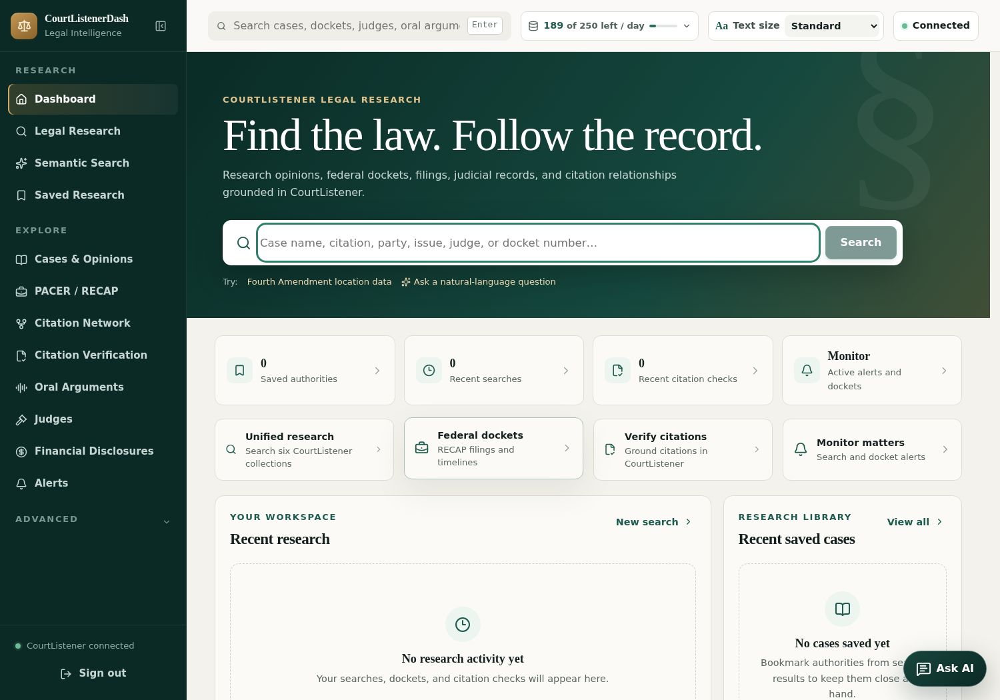

The opening dashboard emphasizes the work an attorney is likely to start:
research, federal dockets, citation checks, saved authorities, and monitoring.
The header shows the connected CourtListener account's remaining minute, hour,
and daily allowance in plain language.

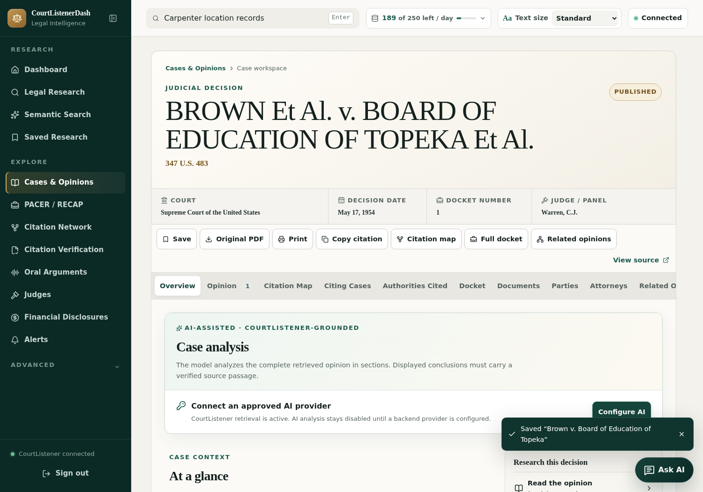

A case opens into one continuous workspace. The lawyer can review the opinion,
docket, parties, counsel, cited authorities, citing decisions, related opinions,
and oral arguments without reconstructing the case across unrelated screens.
Optional AI analysis remains disabled until an approved backend provider is
configured.

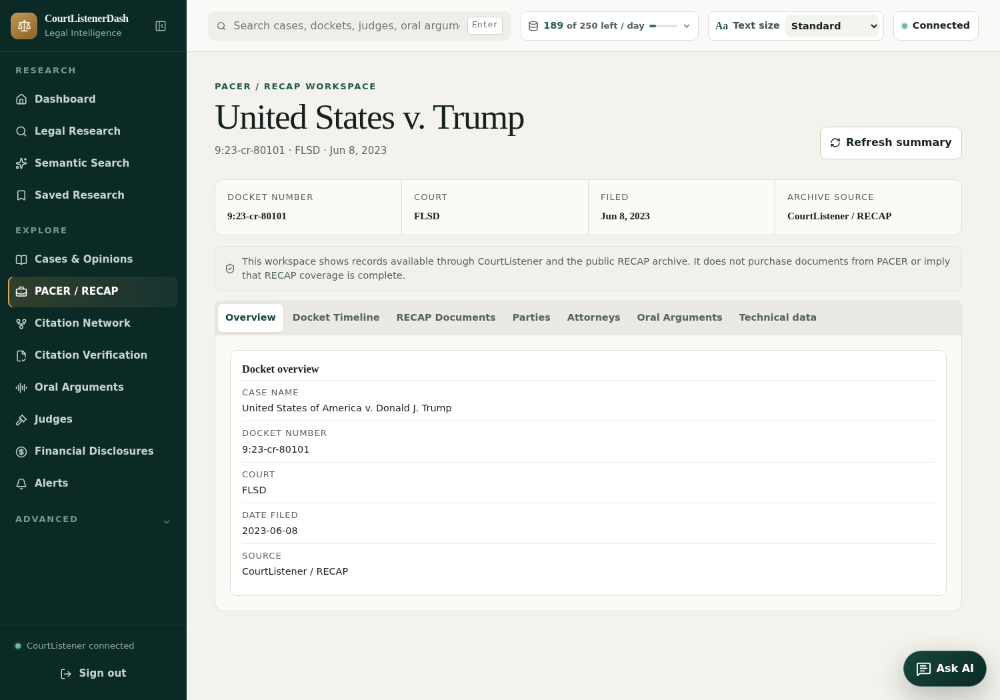

Federal litigation records are presented as a docket—not as generic search
cards. CourtListener/RECAP coverage is clearly distinguished from documents
that may still require PACER.

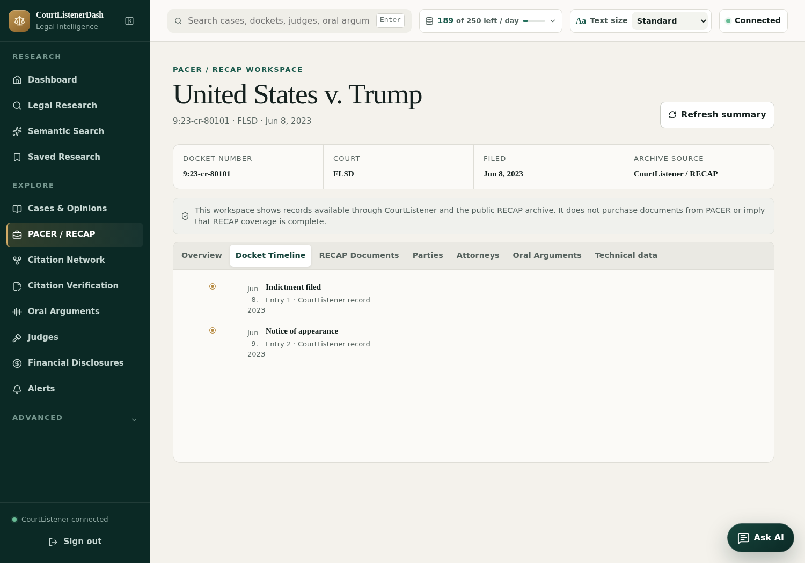

The timeline keeps filings in procedural order. Parties, attorneys, public
documents, attachments, and oral arguments load only when selected, preserving
the connected account's request allowance while keeping the docket easy to
follow.

## Designed for long legal reading sessions

CourtListenerDash uses a deliberately generous type scale, high-contrast
metadata, large controls, visible keyboard focus, and restrained line lengths.
The header's **Text size** menu offers Standard, Large, and Extra large modes;
the choice stays with that browser across pages and future visits.

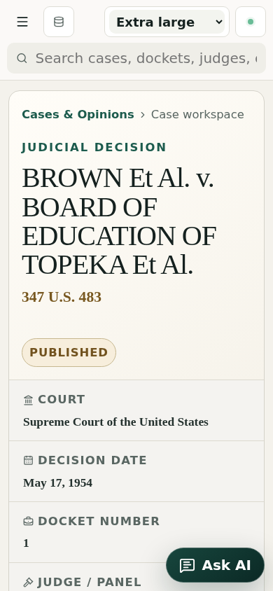

The same research hierarchy adapts to desktop, laptop, tablet, and phone
screens. On a phone, global search receives its own row, case metadata becomes
a readable sequence, toolbars wrap into large targets, and wide legal tables or
graphs scroll inside their own panels. The application frame stays fitted to
the visible browser while the legal-research pane scrolls; compact laptops use
a keyboard-accessible navigation drawer rather than sacrificing reading width.
All 22 top-level and known-record detail routes are checked after their data has
loaded, with representative layouts repeated in Chromium, Firefox, and
WebKit—the browser engine used by Safari. This automated coverage complements,
but does not replace, native screen-reader and physical-device review.

## What can I do with it?

| Research need | What CourtListenerDash provides |
|---|---|
| Find an authority | Search case names, citations, issues, courts, judges, dates, and other CourtListener fields. |
| Explore an unfamiliar issue | Ask a natural-language research question and keep the legal purpose visible beside CourtListener-ranked authorities. |
| Inspect why a result may matter | Optionally use Jev's typed Decision Lens to compare issue, fact, procedure, and direct-answer signals while retaining the CourtListener source and original rank. |
| Get help without leaving the page | Open the persistent Legal Research Assistant to explain the current workspace, inspect its live page index, summarize allowed visible material, identify available controls, ask follow-ups, jump to exact passages, or follow a suggested research destination. |
| Understand a long case | Read the complete opinion and, when an AI provider is configured, generate a structured analysis with holding, rule, facts, reasoning, disposition, and exact supporting passages. |
| Follow federal litigation | Open a RECAP docket, move through its timeline, parties, attorneys, filings, attachments, and available public documents. |
| Check a citation | Extract or resolve citations against CourtListener while distinguishing located, unresolved, ambiguous, and mismatched results. |
| Trace authority | See what an opinion cites and what later opinions cite it, then open connected opinions directly. |
| Hear the argument | Search oral arguments, play CourtListener's secure audio copy, search an available transcript, or download the recording. |
| Research a judge | Review biography, appointments, education, affiliations, and connected public financial-disclosure reports. |
| Monitor developments | Manage CourtListener's own search and docket alerts rather than creating a competing local alert system. |
| Inspect the integration | Use the MCP Console and API Explorer to review tools, supported inputs, timing, errors, schemas, and raw responses. |

### Verify an authority, not merely its citation format

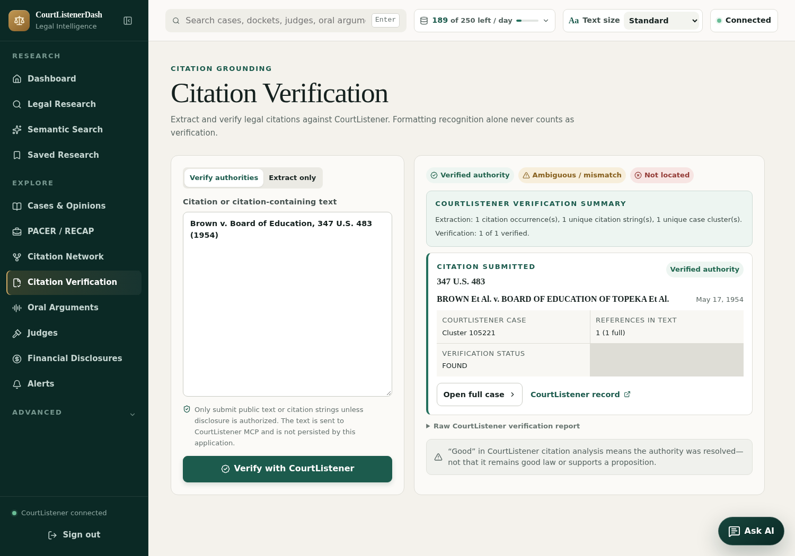

Citation Verification translates CourtListener's analysis into a legal-review
screen. It separates verified, ambiguous, unresolved, and potentially
mismatched citations; shows the resolved case and CourtListener record; and
keeps the original technical report available without forcing it into the
ordinary research workflow.

### Hear the argument and inspect the public judicial record

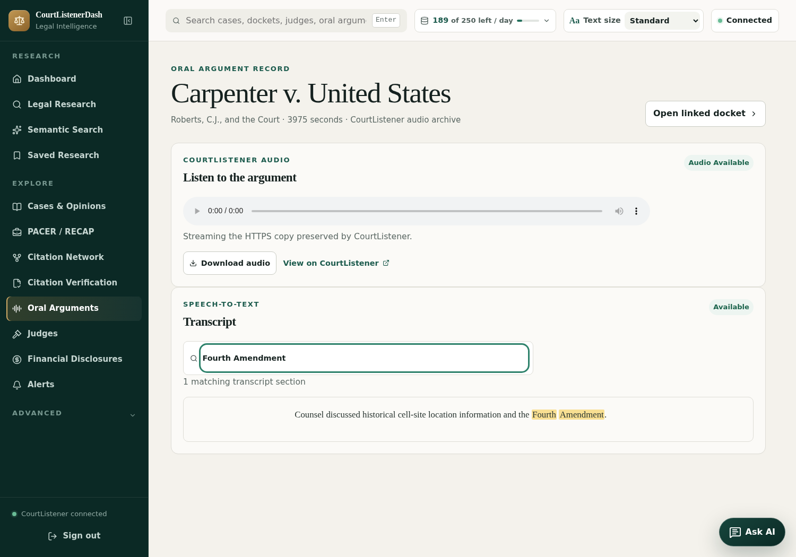

The oral-argument workspace uses CourtListener's preserved HTTPS audio when it
is available, provides a download fallback, and keeps transcript searching and
the linked docket on the same screen.

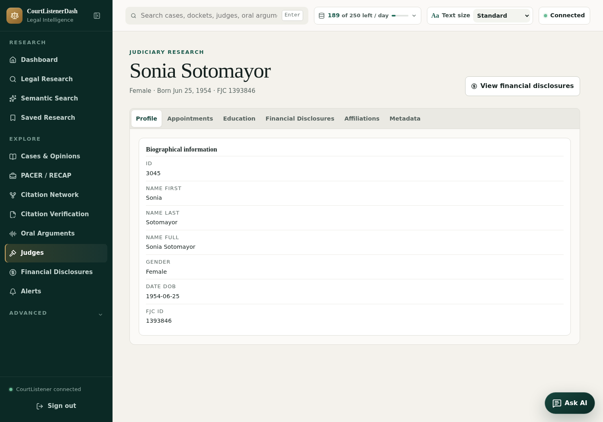

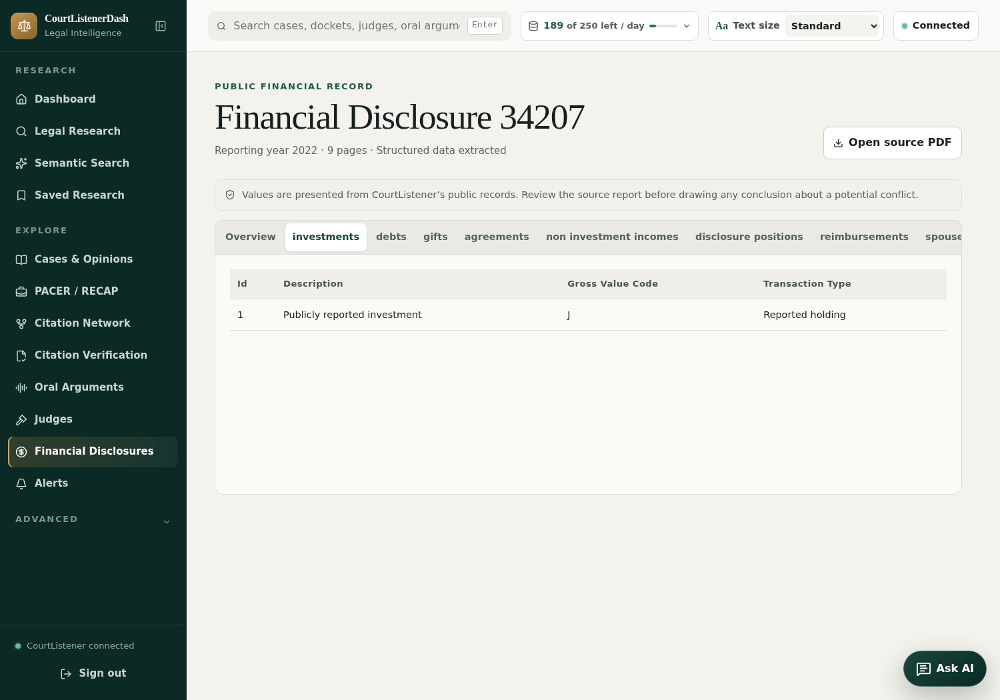

Judicial research progresses from the judge's biography and appointments to
the public source report. Financial categories remain factual, and the source
PDF stays one click away so a researcher can verify the extracted record
before drawing a conclusion.

## Three searches, three clear purposes

CourtListenerDash intentionally avoids a collection of competing search boxes.

1. **Global Search** is the quick starting point. It checks supported
   CourtListener collections and keeps opinions, dockets, filings, audio, and
   people in separate tabs.
2. **Legal Research** is the precise keyword workflow. Choose a collection and
   use only filters CourtListener actually supports. Court choices come from
   CourtListener, so a plain-language value such as “Colorado” is never sent as
   an invalid internal court code.
3. **Semantic Search** is for questions whose meaning matters more than exact
   wording—for example, factually similar cases or decisions that distinguish
   an authority. The research question and intent stay attached to the results.

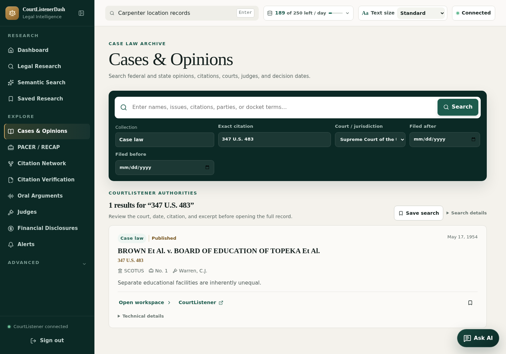

Exact citations have their own field. This prevents a broad name search from
silently opening a similarly titled decision and gives the lawyer a predictable
route to a known authority.

## Grounded AI, not invented authority

AI is optional. CourtListener remains the source of cases, citations, opinions,
dockets, and filings. The AI layer may organize and explain retrieved text, but
it is not allowed to supply an authority from model memory.

Long opinions are processed section by section, then consolidated and checked
against the complete retrieved document. A displayed holding, rule, fact, or
reasoning point must carry an exact passage reference that the lawyer can open
in the opinion. If the evidence cannot be tied back to the source, it is not
shown as a grounded conclusion.

### Jev typed legal intelligence

CourtListenerDash also includes an optional, experimental integration with
[TypeSafe AI's Jev System One model](https://typesafe.ai/). Jev is not used to
write legal prose or invent cases. After CourtListener returns public opinion
results, Jev can make six narrow relevance judgments—legal-issue match,
comparable facts, procedural fit, direct usefulness, limiting treatment, and
overall research fit—and return a probability for each.

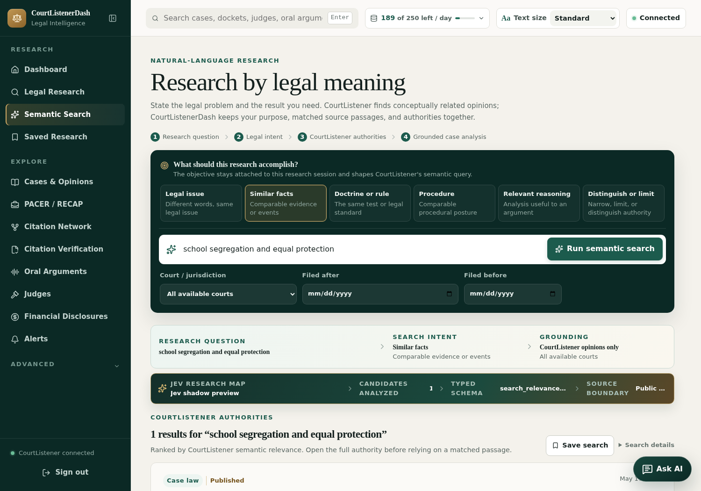

The **Jev Decision Lens** always keeps the CourtListener authority, source
excerpt, original rank, model version, and experimental status visible. Shadow
mode previews Jev's order without changing CourtListener's order. If TypeSafe
is unavailable, the complete original CourtListener result set remains intact.

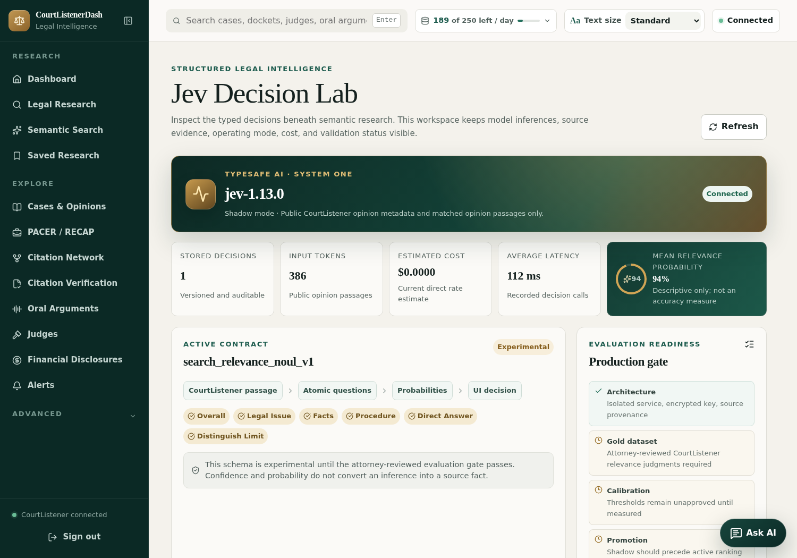

The **Decision Lab** makes model inference auditable: it shows the operating
mode, pinned model, versioned decision schema, data boundary, input-token cost,
latency, cache use, and recent decision records. Active experimental reranking
is available for evaluation, but production adoption is gated by an
attorney-reviewed benchmark. Read the complete
[Jev architecture and evaluation plan](docs/TYPESAFE_JEV_ARCHITECTURE.md).

A persistent **Legal Research Assistant** is available at the bottom-right of
every authenticated page. It understands which workspace is open, can explain
the page, summarize the public CourtListener material currently visible,
identify visible buttons, tabs, and internal links, answer follow-up questions,
and return the lawyer to each exact supporting passage. A trusted navigation
map also lets it explain where the platform's major research areas live.

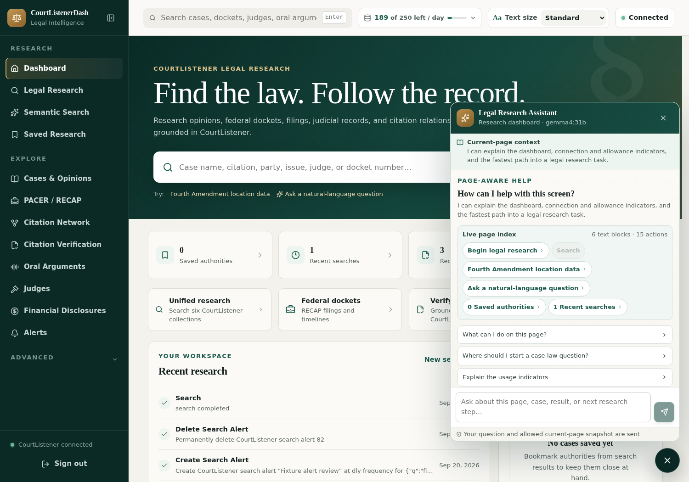

This is real current-page context, not a prerecorded page description. Its
small page-RAG (retrieval-augmented generation) layer observes the rendered
research area while the assistant is open, including changes such as newly
loaded results. It creates a temporary index of visible text and safe control
labels, then retrieves the passages most relevant to the lawyer's question
before calling the configured model. The index exists only in memory; it is not
a new database of browsing activity. Suggested controls are shown as links or
as items the lawyer can locate—the model never clicks, submits, deletes,
purchases, or changes account state by itself.

It does not inspect screen pixels, read hidden tabs, or automatically understand
material that has not been loaded into the page. It never presents a current-
screen snapshot as a complete-document review; long opinions still use the
dedicated section-by-section analysis pipeline.

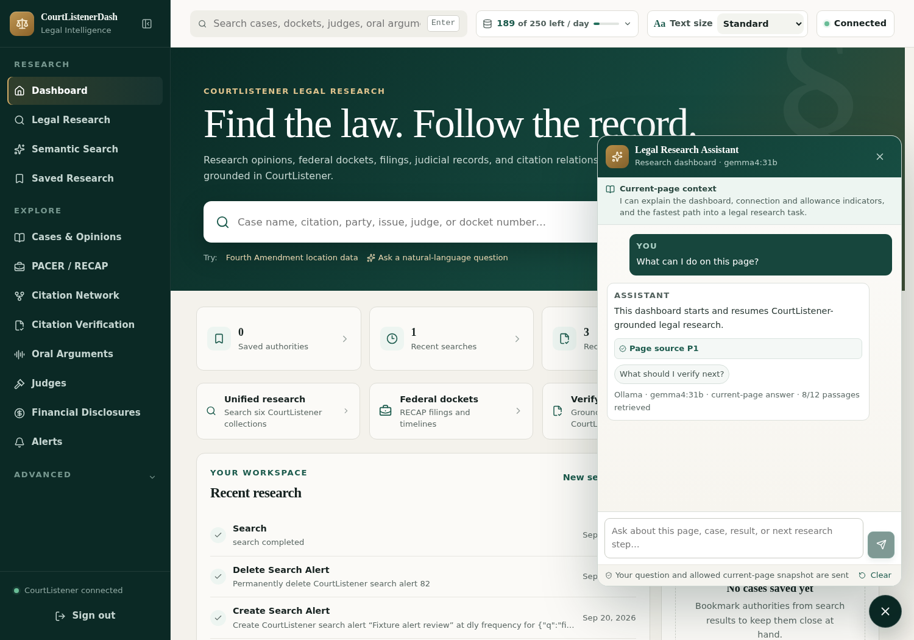

The assistant sends the lawyer's question and only the retrieved portions of
the allowed current-page snapshot after the lawyer asks. That snapshot can
include a visible research query, public CourtListener results, and labels for
visible controls, but never typed form values. Credential forms, Settings,
MCP/API diagnostics, alerts, saved research, and RECAP filing text are excluded
from page capture. Those workspaces still receive navigation help from fixed,
reviewed product guidance. The interface always shows which boundary applies.

The optional provider connection supports paid
[Ollama Cloud](https://docs.ollama.com/cloud), a loopback Ollama service,
OpenAI-compatible endpoints, and Anthropic. In **Settings → Legal AI
Connection**, choose the Ollama connection type, load the live model catalog,
and select a model from the dropdown. The catalog and analysis requests are
made by the backend; an Ollama Cloud key is encrypted at rest and is never
returned to the browser. Manual model entry remains available for compatible
endpoints that do not publish a catalog.

Important limits remain visible:

- CourtListener and RECAP are broad public archives, but their coverage is not
  complete.
- “Not located” does not prove that an authority or filing does not exist.
- A citation-analysis result of `good` means CourtListener resolved the
  citation. It does **not** mean the case is still good law or supports a legal
  proposition.
- A citation relationship is not positive or negative treatment. Use an
  appropriate citator before relying on current-law status.
- Search excerpts and AI summaries are reading aids. Verify the full opinion
  and original document before filing or advising a client.

## Install on a laptop or LAN server

The simplest portable setup uses Docker. You need Docker with Compose, a local
IP address or hostname for the server, and a CourtListener API token.

```bash
cp .env.example .env
# Put the server's LAN address in COURTLISTENER_SITE_ADDRESS inside .env.

docker run --rm -v "$PWD:/workspace" -w /workspace node:24-alpine \
  node deploy/bootstrap.mjs

docker compose up -d --build
```

The setup command displays a one-time administrator password. Save it when it
appears; only a one-way password hash is retained. Then:

1. Open `https://<your-LAN-address>:8443`.
2. Accept or trust the local certificate only on devices that should use this
   private dashboard.
3. Sign in with the one-time password.
4. Open **Settings → CourtListener Connection** and paste the API token.
5. The backend validates and encrypts the token. It is never returned to the
   browser or embedded in frontend JavaScript.

To enable optional grounded case analysis with Ollama Cloud, open **Settings →
Legal AI Connection**, select **Ollama Cloud (paid API)**, paste a backend API
key, choose **Load models**, select an available model, and validate the
connection. Provider billing and account limits remain managed by Ollama.

To evaluate Jev, open **Settings → Jev Intelligence**, paste a TypeSafe API
key, keep the pinned model, and begin in **Shadow preview**. The key is
validated and encrypted by the backend. The implemented Jev workflow sends
only the research question, selected intent, public CourtListener metadata, and
matched public opinion passage—not docket filings, uploads, saved research, or
private matter material.

For Ubuntu/systemd, reverse-proxy, certificate, backup, upgrade, and generic
cloud-container instructions, read the [deployment guide](docs/DEPLOYMENT.md).

## Privacy and account safety

- The dashboard requires an administrator password and uses secure sessions
  and CSRF protection.
- CourtListener and optional legal-AI credentials are encrypted at rest and
  stay on the backend.
- Account-changing actions—creating/deleting alerts, subscribing to a docket,
  or making/withdrawing a RECAP request—require an explicit confirmation.
- Read-only calls may wait and retry after CourtListener throttling;
  account-changing calls are never automatically retried.
- Composite workspaces load one tab at a time to preserve accounts with a
  10-request-per-minute allowance.
- The default deployment is intended for an authorized private network, not an
  open internet port.

## Project records

This repository keeps product decisions and verification evidence beside the
code:

- [Canonical project state and feature-change protocol](docs/PROJECT_STATE.md)
- [Roadmap and milestones](docs/ROADMAP.md)
- [Current product-hardening audit](docs/qa/2026-09-19-product-hardening-audit.md)
- [Latest private-LAN deployment acceptance](docs/qa/2026-09-20-deployment-acceptance.md)
- [TypeSafe Jev prototype milestone and acceptance record](docs/qa/2026-09-20-typesafe-jev-milestone.md)
- [UI readability and cross-browser responsive audit](docs/qa/2026-09-20-ui-readability-responsive-audit.md)
- [Browser action coverage ledger](docs/qa/ACTION_COVERAGE.md)
- [Lessons learned](docs/LESSONS_LEARNED.md)
- [Architecture and trust boundaries](docs/ARCHITECTURE.md)
- [Legal-AI research workflow](docs/LEGAL_AI_RESEARCH_WORKFLOW.md)
- [TypeSafe Jev architecture, evaluation, and opportunity map](docs/TYPESAFE_JEV_ARCHITECTURE.md)
- [Modern legal-research pattern review](docs/LEGAL_RESEARCH_PRODUCT_PATTERNS.md)
- [MCP tool inventory](docs/MCP_TOOL_INVENTORY.md)
- [MCP coverage matrix](docs/MCP_COVERAGE_MATRIX.md)
- [Change history](CHANGELOG.md)
- [Contribution guide](CONTRIBUTING.md)

## Development and verification

```bash
npm install
npm run check
npm test
npm run build
npm run test:e2e:fixture
# Score an existing attorney-reviewed Jev run:
npm run eval:jev -- eval/datasets/reviewed.jsonl
```

The fixture browser workflow uses predictable CourtListener-shaped records and
does not spend an API allowance. The separate live integration audit and live
browser workflow are opt-in because they use the connected CourtListener
account. See the QA audit for the exact, rate-aware commands and known public
test records.

## License status

The source is publicly available for review while a formal open-source license
is selected. Until a `LICENSE` file is added, copyright remains with the project
owner and no general permission to copy, modify, or redistribute the software
is granted. License selection remains a release-readiness item in the roadmap.
